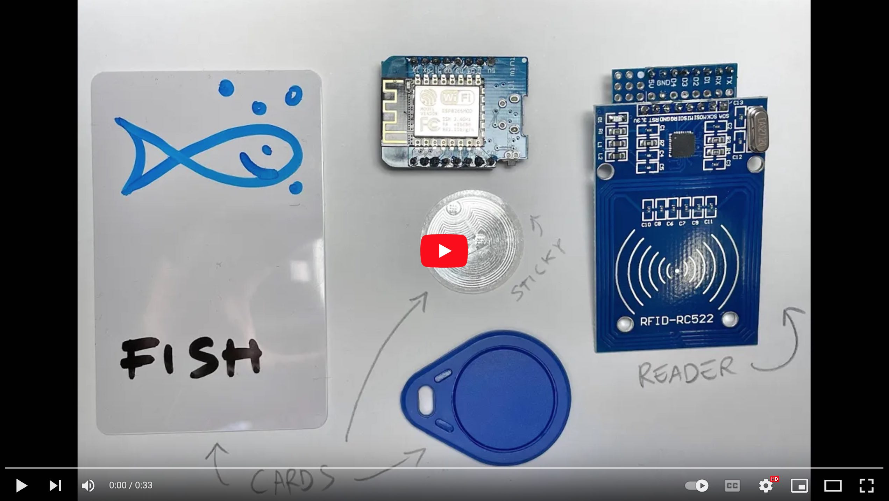

# Flashboard Server Prototype

This is the first prototype of the Flashboard Server. The Flashboard is an
RFID-based, interactive, speaking smart board that can be used at all ages to
teach virtually any concepts.

The [Flashboard Node](https://github.com/flashboard/flashboard-node-proto) is
based on the [ESPHome](https://esphome.io) framework for easy integration.

The board can be physically organized as an actual board, as well as distributed
all around the room. Imagine this deployed in a class, where each pupil has
their own reader, and the teacher assigns them sentences to compose given basic
concepts.

[](https://www.youtube.com/watch?v=T4SWnModmsQ)

- [Flashboard Server Prototype](#flashboard-server-prototype)
    - [Hardware Requirements](#hardware-requirements)
    - [Software Requirements](#software-requirements)
    - [Usage](#usage)
        - [Configure](#configure)
        - [First Launch](#first-launch)
        - [Launch](#launch)
    - [License](#license)

## Hardware Requirements

- A desktop computer or a RaspberryPi (or similar) to host the MQTT server
- A wifi network with an Internet connect

## Software Requirements

- An AWS account
- Python 3.9+
- MQTT server (e.g., [Mosquitto](https://mosquitto.org/))
- [Poetry](https://python-poetry.org/) for Python dependency management

## Usage

```bash
$ git clone https://github.com/flashboard/flashboard-tts-proto
$ cd flashboard-tts-proto
$ poetry install
```

### Configure

Create AWS credentials and ensure you grant full Polly permissions. Don't worry
too much about your AWS bill: the code will cache each spoken object in ram.
Maybe in the future we could save locally, why not.

```bash
$ cp sample.toml .secrets.toml
$ vim .secrets.toml
```

### First Launch

```bash
$ poetry run python main.py
...
2022-02-07 18:21:02.811 | INFO     | __main__:__call__:164 - [A4:91:52:51:56:81] 03-B6-DD-26
2022-02-07 18:21:12.812 | INFO     | __main__:__call__:164 - [A4:91:52:51:56:81] 71-88-CC-26
...
```

Pass each card and look at the log to know their IDs, so that you can substitute
the actual IDs in the `.secrets.toml` file instead of `AA-BB-CC-DD`. It doesn't
matter which reader you use, but make sure they all work by testing distinct
cards on distinct readers.

### Launch

With the correct settings in the `.secrets.toml`, you should now be ready to go.

```bash
$ poetry run python main.py
...
```

## License

```
GNU GENERAL PUBLIC LICENSE Version 3, 29 June 2007

Copyright (C) 2007 Free Software Foundation, Inc. <https://fsf.org/>
Everyone is permitted to copy and distribute verbatim copies
of this license document, but changing it is not allowed.
```
